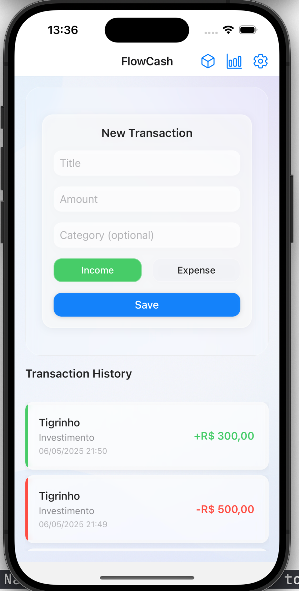
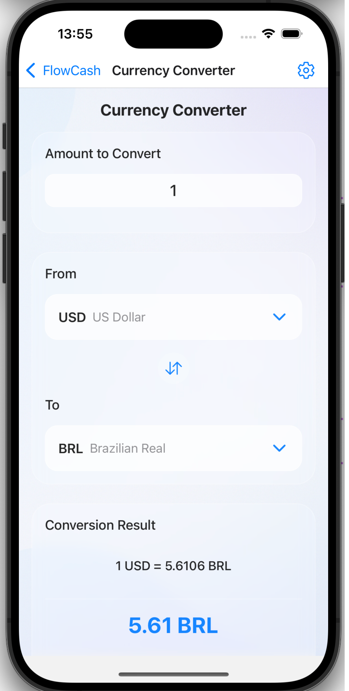
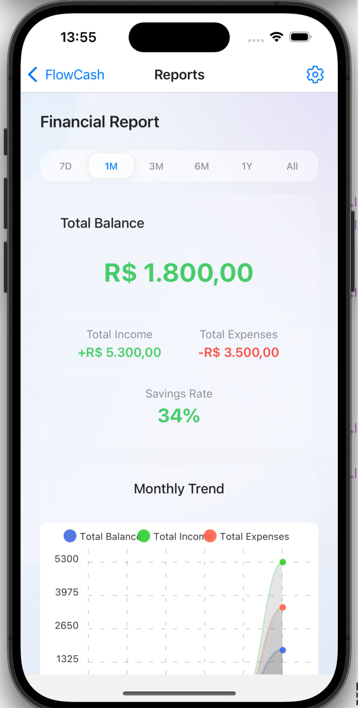
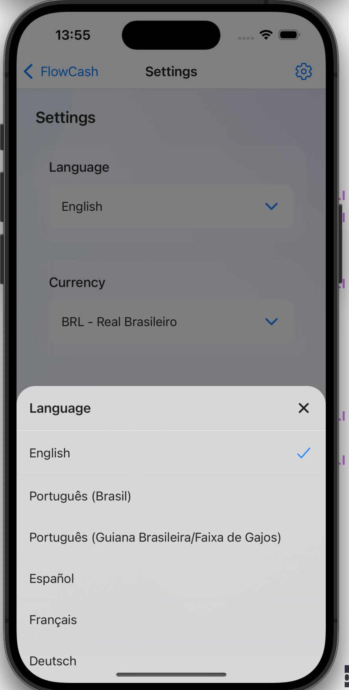

# FlowCash (Work in Progress)

<div align="center">
  

  []()
  []()
  []()
  []()
</div>

**FlowCash** is a modern and elegant personal finance management app built with **React Native** and **Expo**. Designed with a premium glassmorphism-inspired UI and fully offline architecture, it empowers users to track, analyze, and manage their daily finances securely and intuitively — all without depending on cloud services.

---

## ✨ Key Features

- 💸 **Transaction Management**
  Create, edit, and delete income and expense entries with full categorization and notes support.

- 🌍 **Internationalization (i18n)**
  Available in 10+ languages with real-time dynamic locale switching and full RTL support.

- 💱 **Multi-Currency with Live Conversion**
  Supports USD, BRL, EUR, GBP — with exchange-rate based conversions to improve precision.

- 📊 **Analytics Dashboard**
  View spending patterns, top categories, and income vs. expense charts.

- 📜 **Advanced Transaction History**
  Filterable, sortable, and chronologically organized records.

- 📤 **Data Export / Import**
  Backup and restore data via standardized JSON format, with validation and conflict resolution.

- ⚙️ **Personalization Options**
  Choose preferred language, currency, layout display, and more.

- 💾 **Local-Only Persistent Storage**
  All financial data is securely stored on-device using AsyncStorage — no internet required.

- 🎨 **Premium Glassmorphism UI**
  Aesthetic and responsive design optimized for both performance and visual appeal.

- 🔐 **Privacy-First Architecture**
  No cloud sync by default — users retain full control over their financial data.

---

## 🚀 Tech Stack

- **React Native** & **Expo** – Universal mobile app development
- **TypeScript** – Strict type safety across the codebase
- **React Context API** – Modular and efficient state management
- **AsyncStorage** – Offline local data storage
- **React Navigation** – Seamless navigation system with native transitions
- **Expo BlurView** – Smooth glassmorphic UI effects
- **date-fns** – Lightweight date utilities
- **Expo File System & Document Picker** – File I/O support
- **React Hooks** – Declarative logic in functional components

---

## 📱 Screenshots

<div align="center">
  
  
</div>
<div align="center">
  
  
</div>
---

## 🗺️ Roadmap

### ✅ Released Features (v1.0.0)

#### Core
- [x] CRUD for income and expense transactions
- [x] Multi-currency with real-time exchange rates
- [x] Category management (default + custom)
- [x] Data export/import
- [x] Persistent local storage

#### UX & UI
- [x] Glassmorphism design
- [x] Gesture support
- [x] Performance optimizations
- [x] Responsive layout

#### i18n & Localization
- [x] Language switching (10+ languages)
- [x] Locale-aware currency and date formatting
- [x] RTL support

### 🚧 Upcoming Features (v1.1.0 – Q3 2025)

- [ ] Budget planning system
- [ ] Enhanced analytics dashboard
- [ ] In-app transaction search
- [ ] Transaction templates
- [ ] Quick actions (e.g., swipe to add recurring expense)
- [ ] Dark mode support
- [x] Custom transaction categories

### 🔮 Future Plans (v2.0.0)

#### Innovation
- [ ] Investment tracking (manual + real-time for stocks/crypto)
- [ ] Receipt scanning via OCR
- [ ] Biometric authentication

#### Enhancements
- [ ] Recurring transactions
- [ ] Multiple accounts and transfers
- [ ] Budget forecasting
- [ ] Cloud sync (optional)
- [ ] Home screen widgets (iOS + Android)

---

## 📂 Project Structure

```
  .
  ├── assets/ # App icons, fonts, images
  ├── src/
  │ ├── components/ # UI components (shared & domain-specific)
  │ ├── context/ # Context providers (Preferences, Transactions)
  │ ├── localization/ # i18n setup and translation files
  │ ├── navigation/ # App navigation
  │ ├── screens/ # Main screen views
  │ ├── services/ # Business logic (storage, import/export)
  │ ├── styles/ # Theme and design system
  │ ├── types/ # Global TypeScript types
  │ └── utils/ # Utility functions (e.g. currency formatting)
  ├── App.tsx # Entry point
  ├── babel.config.js
  └── package.json
```


---

## 🧠 Architecture Overview

### State Management
- **Component State** for isolated UI logic
- **React Context API** for shared preferences and financial data
- **AsyncStorage** for local persistence
- **Optimistic Updates** and state normalization for performance

### Component Design
- Container/Presenter separation for clean responsibility
- Shared and domain-specific UI components
- Prop drilling avoidance with context
- Strategic use of `React.memo` and `useMemo`

---

## 🌐 Internationalization

- Real-time dynamic language switching
- Support for date/currency/number localization
- RTL layout support
- String interpolation with placeholders
- Languages fully supported:
  - English (en)
  - Portuguese – Brazil (pt-BR)
  - Portuguese – Portugal (pt-PT)
  - Spanish (es)
  - French (fr)
  - German (de)
  - Italian (it)
  - Japanese (ja)
  - Chinese – Simplified (zh-CN)
  - Russian (ru)

---

## ⚙️ Installation

### Requirements
- Node.js 14+
- Yarn or npm
- Expo CLI:

```bash
    npm install -g expo-cli
```

### Setup

  ```bash
    git clone https://github.com/sergiobonatto/flowcash.git
    cd flowcash
    yarn install    # or npm install
    yarn start      # or npm start
  ```

### Run on Device

1 - Install Expo Go on your iOS or Android device.

2 - Scan the QR code displayed in the terminal.

3 - App will open inside Expo Go.

---

## 🧪 Development Workflow

### Scripts

  ```bash
    yarn start       # Start dev server
    yarn ios         # Run on iOS simulator
    yarn android     # Run on Android emulator
    yarn lint        # Run linter
    yarn typescript  # Type checking
  ```

### Best Practices

* Conventional commits (feat:, fix:, chore:)
* Focus on:
  * Type safety
  * Component reuse
  * Architectural consistency
  * Performance-conscious updates
* Unit testing for critical logic (coming soon)

## 🤝 Contributing

FlowCash is an open-source project — contributions are welcome!
1 - Fork the repository
2 - Create a feature branch:
  ```bash
    git checkout -b feature/amazing-feature
  ```
3 - Implement your changes with tests
4 - Submit a PR with a clear description

## 📦 Deployment

The app is currently under active development and has not yet been published to the App Store or Play Store.

## 👨‍💻 Lead Developer
* Sergio Bonatto – Development, design, and architecture

## 📬 Contact & Support
For issues, questions, or suggestions, feel free to:
* Open an issue on the [GitHub repository](https://github.com/sergiobonatto/flowcash)
* Contact the developer via email (for private security concerns)

<p align="center"> Built with ❤️ using React Native, TypeScript, and modern design principles. </p>
